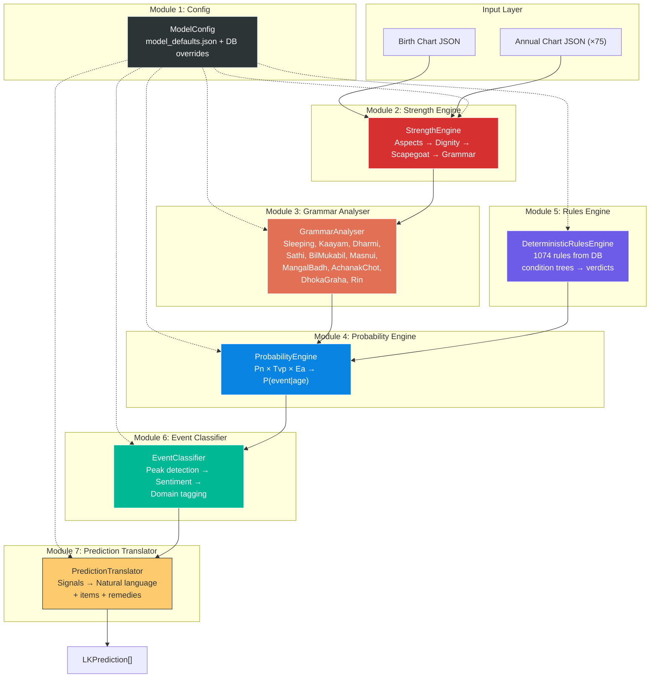

# Lal Kitab Prediction Model v2 — Complete Specification

> Build from scratch using autoresearch + superpowers TDD approach.
> This document is the single source of truth for the prediction engine.

---

## Table of Contents

1. [System Overview](#1-system-overview)
2. [Module Architecture](#2-module-architecture)
3. [Data Contracts](#3-data-contracts)
4. [Module 1: Centralized Config](#4-module-1-centralized-config)
5. [Module 2: Strength Engine](#5-module-2-strength-engine)
6. [Module 3: Grammar Analyser](#6-module-3-grammar-analyser)
7. [Module 4: Probability Engine](#7-module-4-probability-engine)
8. [Module 5: Deterministic Rules Engine](#8-module-5-deterministic-rules-engine)
9. [Module 6: Event Classifier](#9-module-6-event-classifier)
10. [Module 7: Prediction Translator](#10-module-7-prediction-translator)
11. [Pipeline Orchestrator](#11-pipeline-orchestrator)
12. [Test Plan (Superpowers TDD)](#12-test-plan-superpowers-tdd)
13. [Open Items](#13-open-items)

---

## 1. System Overview

### Purpose
Translate raw natal/annual chart data into human-understandable Lal Kitab predictions with:
- Mathematically grounded probability scores
- Timing resolution to the year
- Natural language event descriptions
- Living/non-living item associations
- Remedy hints

### Design Principles
- **Config-Driven**: Every magic number in a single JSON + DB overrides
- **Test-First**: Every module has unit tests BEFORE implementation
- **Strength-Complete**: ALL Lal Kitab grammar factors feed into `strength_total`
- **Deterministic-First**: DB rules fire before any probabilistic computation
- **Modular**: Each module has a clear contract — input type → output type

### Core Equation

```
P(Event | age, domain) = σ(Pn) × Tvp^α × Ea × Dcorr
```

Where:
- `Pn` = Natal Propensity (planet strength × grammar modifiers)
- `Tvp` = Varshaphal Trigger (annual activation intensity)
- `Ea` = Event Affinity (domain-specific rule aggregation)
- `Dcorr` = Deterministic correction (from rules DB)
- `σ` = Adaptive sigmoid with config-driven `k`
- `α` = Config-driven power exponent

---

## 2. Module Architecture



---

## 3. Data Contracts

### 3.1 Input: Chart Data (per chart)

```python
class ChartData(TypedDict, total=False):
    chart_type: str                         # "Birth" | "Yearly"
    chart_period: int                       # 0=birth, 1-75=annual year
    planets_in_houses: dict[str, PlanetInHouse]
    mangal_badh_counter: int
    mangal_badh_status: str
    dharmi_kundli_status: str
    house_status: dict[str, str]            # {"1": "Occupied", "2": "Sleeping House", ...}
    masnui_grahas_formed: list[dict]
    lal_kitab_debts: list[dict]
    achanak_chot_triggers: list[dict]
    varshaphal_metadata: dict[str, Any]
    dhoka_graha_analysis: list[dict]

class PlanetInHouse(TypedDict, total=False):
    house: int
    states: list[str]           # ["Exalted", "Fixed House Lord", ...]
    aspects: list[AspectInfo]
    strength_total: float
    sleeping_status: str
    dharmi_status: str
```

### 3.2 Intermediate: Enriched Planet

```python
class EnrichedPlanet(TypedDict, total=False):
    # From StrengthEngine
    house: int
    raw_aspect_strength: float
    dignity_score: float
    scapegoat_adjustment: float

    # From GrammarAnalyser
    sleeping_status: str
    kaayam_status: str
    dharmi_status: str
    sathi_companions: list[str]
    bilmukabil_hostile_to: list[str]
    is_masnui_parent: bool
    masnui_feedback_strength: float
    dhoka_graha: bool
    achanak_chot_active: bool
    rin_debts: list[str]

    # Final
    strength_total: float
    strength_breakdown: StrengthBreakdown
```

### 3.3 Output: LKPrediction

```python
@dataclass
class LKPrediction:
    domain: str                     # "career", "marriage", "health", etc.
    event_type: str                 # "promotion", "marriage_timing", etc.
    prediction_text: str            # Natural language prediction
    confidence: str                 # "certain", "highly_likely", "possible", "UNLIKELY"
    polarity: str                   # "benefic", "malefic", "mixed", "VOLATILE"
    peak_age: int = 0
    age_window: tuple[int, int] = (0, 0)
    probability: float = 0.0
    affected_people: list[str] = field(default_factory=list)
    affected_items: list[str] = field(default_factory=list)
    source_planets: list[str] = field(default_factory=list)
    source_houses: list[int] = field(default_factory=list)
    source_rules: list[str] = field(default_factory=list)
    remedy_applicable: bool = False
    remedy_hints: list[str] = field(default_factory=list)
```

---

## 4. Module 1: Centralized Config

### File: `backend/astroq/lk_prediction/config.py`
### Data: `backend/data/model_defaults.json`
### DB Tables: `model_config`, `model_config_overrides`

### Config Groups

| Group | Key Prefix | Parameters |
|-------|-----------|------------|
| Strength | `strength.*` | Dignity weights, scapegoat ratios, grammar penalties/boosts |
| Probability | `probability.*` | Sigmoid k, delivery multipliers, natal modifiers |
| Rules | `rules.*` | Boost/penalty scaling, Ea formula constants |
| Timing | `timing.*` | Maturation ages, 35Y cycle structure, age gating |
| Remedy | `remedy.*` | Shifting boost, residual impact |
| Translator | `translator.*` | Confidence thresholds, text templates |

### Resolution Order
```
figure_override(key, figure) → global_override(key) → json_default(key) → HARDCODED_FALLBACK
```

### API

```python
class ModelConfig:
    def __init__(self, db_path: str, defaults_path: str): ...
    def get(self, key: str, figure: str = None) -> Any: ...
    def get_group(self, prefix: str, figure: str = None) -> dict: ...
    def set_override(self, key: str, value: Any, figure: str = None, source: str = "manual"): ...
    def reset_overrides(self, figure: str = None): ...
```

### Tests (Module 1)

```
test_config_loads_defaults_json
test_config_returns_fallback_on_missing_key
test_config_global_override_beats_default
test_config_figure_override_beats_global
test_config_get_group_returns_all_keys
test_config_set_and_retrieve_override
test_config_reset_overrides_clears_figure
test_config_hierarchical_resolution
```

---

## 5. Module 2: Strength Engine

### File: `backend/astroq/lk_prediction/strength_engine.py`

### Pipeline Steps (in order)

```
Step 1: Raw Aspect Calculation
Step 2: Dignity Scoring (Pakka Ghar, Exalted, Debilitated, FHL, Sign Lord)
Step 3: Scapegoat Distribution
Step 4: Natal → Annual Additive Merge (annual charts only)
```

### Constants (from config)

| Config Key | Default | Purpose |
|-----------|---------|---------|
| `strength.natal.pakka_ghar` | 2.20 | Weight for planet in own Pakka Ghar |
| `strength.natal.exalted` | 5.00 | Weight for exaltation |
| `strength.natal.debilitated` | -5.00 | Weight for debilitation |
| `strength.natal.fixed_house_lord` | 1.50 | Weight for FHL status |
| `strength.natal.sign_lord` | 1.00 | Weight for sign lordship |
| `strength.annual_dignity_factor` | 0.50 | Dampening for annual dignity |

### Aspect Calculation

Per the existing `HOUSE_ASPECT_DATA` and `ASPECT_STRENGTH_DATA`:
- For each planet, iterate houses it aspects
- Find planets in those houses
- Calculate raw strength from `ASPECT_STRENGTH_DATA[planet_a][planet_b]`
- Adjust by aspect type and relationship (friend → positive, enemy → negative)
- Sum into `raw_aspect_strength`

### API

```python
class StrengthEngine:
    def __init__(self, config: ModelConfig): ...
    def calculate_chart_strengths(self, chart: ChartData) -> dict[str, EnrichedPlanet]: ...
    def merge_natal_annual(self, natal: dict, annual: dict) -> dict: ...
```

### Tests (Module 2)

```
test_aspect_strength_sun_h1_aspects_h7
test_aspect_strength_friend_returns_positive
test_aspect_strength_enemy_returns_negative
test_dignity_exalted_adds_weight
test_dignity_debilitated_subtracts_weight
test_dignity_pakka_ghar_adds_weight
test_scapegoat_distributes_negative_to_targets
test_natal_annual_merge_is_additive
test_empty_chart_returns_zero_strength
test_strength_breakdown_sums_to_total
```

---

## 6. Module 3: Grammar Analyser

### File: `backend/astroq/lk_prediction/grammar_analyser.py`

This module detects ALL Lal Kitab grammar conditions AND feeds them back into `strength_total`. This is the key enhancement — currently these are computed as flags but not incorporated into strength.

### Grammar Elements (15 total)

| # | Element | Detection Logic | Strength Impact |
|---|---------|----------------|-----------------|
| 1 | **Sleeping Planet** | Not in Pakka Ghar AND doesn't aspect any planet | `strength *= cfg.sleeping_planet_factor` (default: 0.0) |
| 2 | **Sleeping House** | Empty AND not aspected by any planet | Planets associated with house get penalty |
| 3 | **Kaayam Graha** | Strong (exalted/high strength) AND no enemy interference | `strength *= cfg.kaayam_boost` (default: 1.15) |
| 4 | **Dharmi Graha** | Rahu/Ketu in H4 or with Moon; Saturn in H11 or with Jupiter | `strength += cfg.dharmi_planet_boost` (default: 1.50) |
| 5 | **Dharmi Kundli** | Saturn-Jupiter conjunction | All benefics get `strength *= cfg.dharmi_kundli_boost` (default: 1.20) |
| 6 | **Sathi Graha** | Mutual exchange in exaltation/debilitation/pakka houses | `strength += cfg.sathi_boost_per_companion` (default: 1.00) per companion |
| 7 | **Bil Mukabil** | Natural friends + significant aspect + enemy in other's foundational house | `strength -= cfg.bilmukabil_penalty_per_hostile` (default: 1.50) per hostile |
| 8 | **Mangal Badh** | Counter from 10 conditions (Sun-Saturn together, etc.) | `mars_strength -= strength * (1 + counter/cfg.mangal_badh_divisor)` |
| 9 | **Masnui Graha** | Two planets in same house form artificial third | Masnui gets full aspects+strength; `parent_strength += cfg.masnui_parent_feedback * masnui_strength` |
| 10 | **Dhoka Graha** | Planet gives false promises (context-dependent) | `strength *= cfg.dhoka_graha_factor` (default: 0.70) |
| 11 | **Achanak Chot** | Sudden event trigger conditions met | `strength -= cfg.achanak_chot_penalty` (default: 2.00) |
| 12 | **Rin (Debt)** | Pitri/Matri/Stri Rin conditions from house occupancy | `strength *= cfg.rin_penalty_factor` (default: 0.85) |
| 13 | **35Y Ruler** | Current age maps to cycle ruler planet | `ruler_strength *= cfg.cycle_35yr_boost` (default: 1.25) |
| 14 | **Disposition Rules** | Planet X in house Y spoils/boosts planet Z | `affected_strength ±= abs(causer_strength)` |
| 15 | **Confrontation** | Planets in houses 1↔7, 2↔8, etc. | Negative aspect strength already in Step 1 |

### Processing Order

```
1. Detect all grammar flags (sleeping, kaayam, dharmi, sathi, bilmukabil)
2. Apply disposition rules (planet X spoils planet Y)
3. Apply Mangal Badh reduction
4. Apply 35Y ruler boost
5. Apply Bil Mukabil penalty       [NEW — not in current strength]
6. Apply Sathi companion boost     [NEW — not in current strength]
7. Apply Dhoka Graha penalty       [NEW — not in current strength]
8. Apply Sleeping factor           [NEW — not in current strength]
9. Apply Dharmi boost              [NEW — not in current strength]
10. Apply Achanak Chot penalty     [NEW — not in current strength]
11. Apply Rin penalty              [NEW — not in current strength]
12. Compute Masnui aspects + strength
13. Apply Masnui → parent feedback [NEW — not in current strength]
```

### API

```python
class GrammarAnalyser:
    def __init__(self, config: ModelConfig): ...
    def analyse(self, chart: ChartData, enriched_planets: dict) -> dict[str, EnrichedPlanet]: ...
    
    # Individual detectors (public for testing)
    def detect_sleeping(self, planet: str, planets: dict) -> str: ...
    def detect_kaayam(self, planet: str, planets: dict) -> str: ...
    def detect_dharmi(self, planet: str, planets: dict) -> str: ...
    def detect_sathi(self, p1: str, p2: str, planets: dict) -> bool: ...
    def detect_bilmukabil(self, p1: str, p2: str, planets: dict) -> bool: ...
    def detect_mangal_badh(self, chart: ChartData) -> int: ...
    def detect_masnui(self, chart: ChartData) -> list[dict]: ...
    def detect_rin(self, chart: ChartData) -> list[dict]: ...
    def detect_achanak_chot(self, chart: ChartData) -> list[dict]: ...
```

### Tests (Module 3)

```
test_sleeping_planet_no_aspects_returns_sleeping
test_sleeping_planet_in_pakka_ghar_returns_awake
test_sleeping_planet_aspects_other_returns_awake
test_kaayam_exalted_no_enemies_returns_kaayam
test_kaayam_enemy_in_associated_returns_not_kaayam
test_dharmi_rahu_in_h4_returns_dharmi
test_dharmi_saturn_with_jupiter_returns_dharmi
test_dharmi_kundli_sat_jup_conjunction_returns_dharmi_teva
test_sathi_mutual_exchange_returns_true
test_sathi_no_exchange_returns_false
test_bilmukabil_friends_enemy_in_foundation_returns_true
test_bilmukabil_no_significant_aspect_returns_false
test_mangal_badh_all_conditions_returns_high_counter
test_mangal_badh_no_conditions_returns_zero
test_masnui_two_planets_same_house_forms_artificial
test_masnui_parent_gets_feedback_strength
test_achanak_chot_trigger_conditions
test_rin_pitri_detected_from_house_pattern
test_grammar_strength_bilmukabil_reduces_total
test_grammar_strength_sathi_increases_total
test_grammar_strength_sleeping_zeros_total
test_grammar_strength_dharmi_boosts_total
test_grammar_strength_all_factors_compound
test_strength_breakdown_has_all_14_components
```

---

## 7. Module 4: Probability Engine

### File: `backend/astroq/lk_prediction/probability_engine.py`

### Core Equation

```
P(event | age, domain) = clamp(0, 1,
    σ(Pn, k) × Tvp^α × Ea × Dcorr
)
```

### A. Natal Propensity (Pn)

For each planet, per domain:

```python
# Base: absolute strength through adaptive sigmoid
Pn_raw = sigmoid(abs(strength_total), k=cfg.sigmoid.k_adaptive(strength))

# Modifiers (all from config):
if fate_type == "graha_phal":   Pn_raw *= cfg.natal.graha_phal_multiplier    # 1.50
if is_dharmi:                   Pn_raw *= cfg.natal.dharmi_planet_boost       # 1.20
if is_dhoka:                    Pn_raw *= cfg.natal.dhoka_graha_penalty       # 0.82
if has_masnui_part:             Pn_raw *= cfg.natal.masnui_part_boost         # 1.25
if rin_active:                  Pn_raw *= cfg.natal.rin_global_penalty        # 0.85
if sleeping and not awakened:   Pn_raw *= cfg.natal.sleeping_natal_factor     # 0.85

# Domain alignment bonus:
if planet in DOMAIN_MAPS[domain].primary_planets:
    Pn_raw *= 1.3  # Aligned to target domain
```

### B. Varshaphal Trigger (Tvp)

Annual activation intensity for each planet-year:

```python
Tvp = 0.0
annual_strength = abs(enriched_planets[planet].strength_total)
Tvp_base = sigmoid(annual_strength, k=cfg.sigmoid.k_adaptive(annual_strength))

# Delivery multipliers (from config):
if planet transits to its pucca_ghar:     Tvp += Tvp_base * cfg.delivery.pucca_ghar       # 1.8
if planet stays in same_house (intensify): Tvp += Tvp_base * cfg.delivery.intensification  # 2.0
if current_age == maturation_age:          Tvp += Tvp_base * cfg.delivery.maturation        # 1.8
if planet is 35yr_cycle_ruler:             Tvp += Tvp_base * cfg.delivery.throne_transit    # 1.8

# Year lord boost:
if planet == year_lord:  Tvp += cfg.year_lord.base_boost  # 4.0
```

### C. Event Affinity (Ea)

From deterministic rules that fire for this chart-year:

```python
boost_sum = sum(rule.magnitude for rule in fired_rules if rule.scoring_type == "boost")
penalty_sum = sum(rule.magnitude for rule in fired_rules if rule.scoring_type == "penalty")

boost_impact = boost_sum * cfg.rules.boost_scaling      # 0.04
penalty_impact = min(penalty_sum * cfg.rules.penalty_scaling, cfg.rules.penalty_cap)  # 0.15, 0.8
if dharmi_kundli: penalty_impact *= cfg.rules.dharmi_penalty_reduction  # 0.5

Ea = 1.0 + boost_impact - penalty_impact
```

### D. Deterministic Correction (Dcorr)

Direct probability overrides from high-confidence rules:

```python
# Rules with magnitude > 0.7 and success_weight > 0.8 are "deterministic"
for rule in deterministic_rules:
    if rule fires AND rule.success_weight > 0.8:
        Dcorr = max(Dcorr, 1.0 + rule.magnitude)
```

### API

```python
class ProbabilityEngine:
    def __init__(self, config: ModelConfig): ...
    def calculate_natal_propensity(self, planet: str, enriched: EnrichedPlanet, domain: str) -> float: ...
    def calculate_varshaphal_trigger(self, planet: str, natal: EnrichedPlanet, annual: EnrichedPlanet, age: int, domain: str) -> float: ...
    def calculate_event_affinity(self, fired_rules: list, chart: ChartData) -> float: ...
    def calculate_yearly_probability(self, domain: str, age: int, natal_chart: dict, annual_chart: dict, fired_rules: list) -> dict: ...
    def run_domain_model(self, domain: str, natal: dict, annual_charts: dict[int, dict], rules_by_year: dict) -> list[dict]: ...
```

### Tests (Module 4)

```
test_sigmoid_returns_low_for_average_strength
test_sigmoid_returns_high_for_strong_planet
test_adaptive_k_decreases_for_high_strength
test_natal_propensity_graha_phal_multiplied
test_natal_propensity_sleeping_reduced
test_natal_propensity_domain_aligned_boosted
test_tvp_pucca_ghar_transit_spikes
test_tvp_intensification_doubles
test_tvp_maturation_age_spikes
test_tvp_year_lord_boosted
test_ea_boosts_increase_affinity
test_ea_penalties_decrease_affinity
test_ea_dharmi_halves_penalties
test_ea_capped_at_penalty_max
test_yearly_probability_combines_pn_tvp_ea
test_probability_clamps_to_0_1
test_domain_model_returns_75_years
test_peak_detection_finds_highest_probability_year
```

---

## 8. Module 5: Deterministic Rules Engine

### File: `backend/astroq/lk_prediction/rules_engine.py`

Wraps the existing `deterministic_rules` table (1074 rules, 10 domains).

### Rule Schema (from DB)

### Rule Schema (`rules.db`)

Each deterministic rule (of the 1074 legacy Lal Kitab rules) is stored as a row in the `deterministic_rules` SQLite table matching this precise schema:

```sql
id TEXT PRIMARY KEY
domain TEXT NOT NULL
description TEXT NOT NULL
condition TEXT NOT NULL        -- The JSON Abstract Syntax Tree (AST)
verdict TEXT NOT NULL
scale TEXT NOT NULL            -- "minor", "moderate", "major", "extreme"
scoring_type TEXT NOT NULL     -- "boost", "penalty", "neutral"
source_page TEXT
success_weight REAL DEFAULT 1.0
```

### JSON Condition AST Structure

The logic for triggering each specific astrological event is stored entirely in JSON under the `condition` field using recursive nodes.

**Logical Operators:**
```json
{
  "type": "AND",  // or "OR", "NOT"
  "conditions": [ ... array of sub-nodes ... ]
}
```

**Supported Astrological Condition Leaf Types:**
| Type | Fields | Evaluates |
|------|--------|-----------|
| `placement` | `planet`, `houses` (array) | Is planet in any of the specified houses? |
| `house_status` | `house`, `state` | Is house empty/occupied? |
| `confrontation` | `planet_a`, `planet_b` | Does Planet A aspect Planet B with 100% strength? |
| `conjunction` | `planets`, `house` | Are multiple planets conjunct in a specific house? |
| `planet_state` | `planet`, `condition` | Is the planet in a specific grammar state (Sleeping, Exalted)? |

*Note: The legacy rules utilize elaborate `AND`/`OR` nesting within these elements precisely to replicate complex textual Lal Kitab conditions.*

### API

```python
class RulesEngine:
    def __init__(self, cfg_or_db_path: ModelConfig | str): ...
    def evaluate_chart(self, chart: dict[str, Any]) -> list[RuleHit]: ...
    def _evaluate_node(self, node: dict, pd: dict) -> tuple[bool, int, set[str], set[int]]: ...
    # Safely skips NoneType branches from malformed JSON
```

### Tests (Module 5)

The TDD tests ensure the recursive JSON AST parses and evaluates correctly without breaking the pipeline.

```
test_rules_engine_evaluates_placement_node
test_rules_engine_evaluates_confrontation_node
test_rules_engine_evaluates_nested_and_or_nodes
test_rules_engine_applies_scale_to_magnitude
test_rules_engine_ignores_nonetype_malformed_nodes

---

## 9. Module 6: Event Classifier

### File: `backend/astroq/lk_prediction/event_classifier.py`

### Peak Detection (Hybrid Filter)

A year is flagged as a **peak event** only if:
1. **Absolute**: `probability > cfg.threshold_absolute` (default: 0.70)
2. **Momentum**: `delta(probability, year-1) > cfg.threshold_delta` (default: 0.25)

### Sentiment Classification

| Condition | → Sentiment |
|-----------|------------|
| Ea > 1.1 AND low penalties | **BENEFIC** |
| Ea < 0.9 OR high penalties | **MALEFIC** |
| High boosts AND high penalties | **VOLATILE** |
| Mixed signals | **MIXED** |

### Domain Classification

Map fired rules to life domains:
```python
DOMAIN_WEIGHTS = {
    "profession": [H10, H6, H11],  # Primary houses
    "marriage":   [H7, H2, H11],
    "health":     [H1, H6, H8],
    "wealth":     [H2, H11, H9],
    "progeny":    [H5, H2, H9],
    "travel":     [H9, H12, H3],
    "education":  [H4, H5, H9],
    "family":     [H2, H4, H3]
}
```

### API

```python
class EventClassifier:
    def __init__(self, config: ModelConfig): ...
    def detect_peaks(self, probability_curve: list[dict]) -> list[dict]: ...
    def classify_sentiment(self, ea: float, fired_rules: list) -> str: ...
    def classify_domain(self, fired_rules: list, source_houses: list) -> str: ...
    def classify_event(self, peak: dict, fired_rules: list, enriched_planets: dict) -> ClassifiedEvent: ...
```

### Tests (Module 6)

```
test_peak_detection_finds_spike_above_threshold
test_peak_detection_ignores_gradual_rise
test_peak_detection_requires_both_absolute_and_delta
test_sentiment_high_boost_low_penalty_returns_benefic
test_sentiment_high_penalty_returns_malefic
test_sentiment_high_both_returns_volatile
test_domain_classification_h10_rules_return_profession
test_domain_classification_h7_rules_return_marriage
```

---

## 10. Module 7: Prediction Translator

### File: `backend/astroq/lk_prediction/prediction_translator.py`

### Translation Pipeline

```
ClassifiedEvent → Agent Resolution → Item Resolution → Text Generation → LKPrediction
```

### Agent Resolution

For each planet in the event, resolve:
- **Living items**: People affected (father, wife, son, etc.)
- **Non-living items**: Objects involved (gold, property, vehicle)
- **Body parts**: Health targets
- **Professions**: Career associations

Source: `items_resolver.py` Sheets 1, 17, 19, 21, 23

### Confidence Mapping

| Fate Signal | → Confidence Level |
|------------|-------------------|
| Graha Phal + strong peak | `"certain"` — *"It is certain that..."* |
| Graha Phal + moderate peak | `"highly_likely"` — *"It is highly likely..."* |
| Rashi Phal + strong peak | `"strong_possibility"` — *"There is a strong possibility..."* |
| Rashi Phal + moderate peak | `"possible"` — *"You may experience..."* |
| Sleeping + no awakening | `"dormant"` — *"This area remains dormant..."* |
| Rin active | `"karmic"` — *"Due to ancestral patterns..."* |

### Prediction Text Grammar

```
PREDICTION = [CONFIDENCE] + [TIMING] + [EVENT] + [TARGET] + [QUALIFIER] + [REMEDY_HINT]
```

Example:
> *"It is highly likely (Graha Phal) that at age 28, you will receive a significant career advancement — likely in government/administration. Your father's reputation will also benefit during this period. Remedy: Wear gold ring on right hand ring finger on Sundays."*

### API

```python
class PredictionTranslator:
    def __init__(self, config: ModelConfig, items_resolver: LKItemsResolver): ...
    def translate(self, event: ClassifiedEvent, enriched_natal: dict, enriched_annual: dict) -> LKPrediction: ...
    def resolve_agents(self, planets: list[str], houses: list[int]) -> dict: ...
    def resolve_items(self, planets: list[str]) -> dict: ...
    def generate_text(self, event: ClassifiedEvent, agents: dict, items: dict) -> str: ...
    def map_confidence(self, fate_type: str, probability: float) -> str: ...
```

### Tests (Module 7)

```
test_confidence_graha_phal_high_prob_returns_certain
test_confidence_rashi_phal_returns_possible
test_confidence_sleeping_returns_dormant
test_confidence_rin_returns_karmic
test_agent_resolution_sun_returns_father
test_agent_resolution_venus_h7_returns_wife
test_item_resolution_mars_returns_iron_weapons
test_text_generation_includes_timing
test_text_generation_includes_confidence_prefix
test_text_generation_includes_remedy_hint
test_full_translation_returns_lk_prediction
```

---

## 11. Pipeline Orchestrator

### File: `backend/astroq/lk_prediction/pipeline.py`

### Execution Flow

### Execution Flow

```python
class LKPredictionPipeline:
    def __init__(self, config: ModelConfig) -> None:
        self.cfg = config
        self.strength_engine = StrengthEngine(config)
        self.grammar_analyser = GrammarAnalyser(config)
        self.rules_engine = RulesEngine(config)
        self.prob_engine = ProbabilityEngine(config)
        self.classifier = EventClassifier(config)
        self.translator = PredictionTranslator(config)
        
        # State: Maintains momentum metrics across sequential chart calls
        self._natal_baseline: dict[str, EnrichedPlanet] | None = None
        self._prediction_history: dict[str, float] = {}

    def load_natal_baseline(self, chart: ChartData) -> None:
        # Calculate base strengths -> Apply grammar -> Save baseline
        pass

    def generate_predictions(
        self, chart: ChartData, focus_domains: list[str] | None = None
    ) -> list[LKPrediction]:
        # 1. Base Strengths & Additive Merge (if Annual)
        # 2. Grammar Analyser
        # 3. Format context & Rules Engine Evaluation
        # 4. Probabilities & Momentum History Update
        # 5. Classify Sentiment/Domains
        # 6. Translate to Natural Language LKPrediction objects
        pass
```

### Tests (Pipeline)

```
test_pipeline_returns_list_of_lk_predictions
test_pipeline_with_known_chart_finds_expected_peak_age
test_pipeline_career_domain_returns_profession_predictions
test_pipeline_marriage_domain_returns_marriage_predictions
test_pipeline_empty_chart_returns_no_predictions
test_pipeline_all_domains_returns_comprehensive_predictions
```

---

## 12. Test Plan (Superpowers TDD)

### Test Directory Structure

```
backend/tests/lk_prediction/
├── conftest.py              # Shared fixtures (sample charts, configs)
├── test_config.py           # Module 1: 8 tests
├── test_strength_engine.py  # Module 2: 10 tests
├── test_grammar_analyser.py # Module 3: 23 tests
├── test_probability_engine.py # Module 4: 18 tests
├── test_rules_engine.py     # Module 5: 14 tests
├── test_event_classifier.py # Module 6: 8 tests
├── test_prediction_translator.py # Module 7: 11 tests
├── test_pipeline.py         # Integration: 6 tests
└── test_benchmark.py        # Regression: vs ground truth figures
```

### Test Fixtures (conftest.py)

```python
SAMPLE_NATAL_CHART = {
    "chart_type": "Birth",
    "chart_period": 0,
    "planets_in_houses": {
        "Sun": {"house": 1, "states": ["Exalted"], "aspects": [], "strength_total": 0},
        "Moon": {"house": 4, "states": ["Fixed House Lord"], ...},
        "Mars": {"house": 3, "states": ["Fixed House Lord"], ...},
        "Mercury": {"house": 7, "states": [], ...},
        "Jupiter": {"house": 2, "states": ["Fixed House Lord"], ...},
        "Venus": {"house": 7, "states": [], ...},
        "Saturn": {"house": 10, "states": ["Fixed House Lord"], ...},
        "Rahu": {"house": 12, "states": [], ...},
        "Ketu": {"house": 6, "states": [], ...}
    },
    "mangal_badh_counter": 0,
    "dharmi_kundli_status": "Not Dharmi Teva",
    ...
}

# Known ground truth chart for validation
SACHIN_BIRTH_CHART = { ... }  # Real chart data
SACHIN_KNOWN_EVENTS = [
    {"domain": "profession", "age": 16, "event": "Test debut"},
    {"domain": "profession", "age": 25, "event": "World Cup"},
    ...
]
```

### Build Order (TDD Sequence)

```
Phase 1: Config     → Write tests → Implement → Green
Phase 2: Strength   → Write tests → Implement → Green
Phase 3: Grammar    → Write tests → Implement → Green
Phase 4: Rules      → Write tests → Implement → Green
Phase 5: Probability → Write tests → Implement → Green
Phase 6: Classifier → Write tests → Implement → Green
Phase 7: Translator → Write tests → Implement → Green
Phase 8: Pipeline   → Write tests → Implement → Green
Phase 9: Benchmark  → Run against ground truth figures
Phase 10: Tune      → Adjust config overrides per figure → Re-benchmark
```

### Benchmark Metrics

| Metric | Target | Formula |
|--------|--------|---------|
| **Hit Rate** | > 80% | Events within ±2 years of ground truth / total events |
| **Offset** | < 2.0 | Mean absolute error in years |
| **Natal Accuracy** | > 85% | Correct domain identification at natal level |
| **False Positive Rate** | < 15% | Predicted peaks with no matching ground truth event |

---

## 13. Open Items

| Item | Priority | Status |
|------|----------|--------|
| Consolidate `planet_predictions_consolidated.csv` into DB `prediction_texts` table | Medium | TBD — not in current scope |
| Auto-tune config via benchmark feedback loop | High | Deferred to Phase 10 |
| LLM-based natural language polishing of prediction text | Low | Future enhancement |
| Expand deterministic rules beyond 1074 (additional Goswami tables) | Medium | Depends on data extraction |
| Frontend integration for prediction display | Low | After backend complete |

---

## 14. Complete Grammar Feature Reference

> **CRITICAL**: This section documents the EXACT rules from the reference codebase that must be
> implemented in full. No stubs allowed. Every rule below has a corresponding test.

---

### 14.1 Mangal Badh — Complete 17-Rule System

**Source**: `D:\astroq-mar26\backend\astroq\Mars_special_rules.py` → `calculate_mangal_badh()`

The Mangal Badh counter uses **additive increment** (13 rules) and **subtractive decrement** (4 rules).
Final counter can be negative (means NO Mangal Badh).

#### Increment Rules (+1 each)

| Rule | Condition |
|------|-----------|
| R1 | Sun and Saturn are conjunct (same house) |
| R2 | Sun does NOT cast an aspect to Mars |
| R3 | Moon does NOT cast an aspect to Mars |
| R4 | Mercury in H6 **AND** Ketu in H6 |
| R5 | Mars+Mercury conjunct **OR** Mars+Ketu conjunct |
| R6 | Ketu in H1 |
| R7 | Ketu in H8 |
| R8 | Mars in H3 |
| R9 | Venus in H9 |
| R10 | Sun in any of H6, H7, H10, H12 |
| R11 | Mars in H6 |
| R12 | Mercury in any of H1, H3, H8 |
| R13 | Rahu in any of H5, H9 |

> **Note**: R2/R3 may appear twice in the original logic for a max total of 17 increments.
> The counter is computed as `sum(increments) - sum(decrements)`.

#### Decrement Rules (−1 each)

| Rule | Condition |
|------|-----------|
| D1 | Sun and Mercury are conjunct (same house) |
| D2 | Mars in H8 **AND** Mercury in H8 |
| D3 | Sun in H3 **AND** Mercury in H3 |
| D4 | Moon in any of H1, H2, H3, H4, H8, H9 |

#### Strength Reduction Formula

```python
# Applied to Mars strength AFTER all disposition rules
mangal_badh_counter = max(0, counter)   # only apply if positive
reduction = abs(mars_strength_total) * (1 + mangal_badh_counter / 16.0)
mars_new_strength = mars_strength_total - reduction
```

> **Config Key**: `strength.mangal_badh_divisor` must be **16.0** (NOT 5.0).
> The formula is: `strength * (1 + counter/divisor)` is the **reduction amount**,
> subtracted from the current strength.

#### Aspect Detection Helper

To check if planet A "aspects" planet B, use the canonical Lal Kitab aspect map:

```python
HOUSE_ASPECT_MAP = {
    1: [7], 2: [6], 3: [9, 11], 4: [10], 5: [9],
    6: [12], 7: [1], 8: [], 9: [3, 5], 10: [4],
    11: [3, 5], 12: [6]
}

def planet_aspects(planet_a, planet_b, planets_data):
    h_a = planets_data.get(planet_a, {}).get("house")
    h_b = planets_data.get(planet_b, {}).get("house")
    if not h_a or not h_b:
        return False
    return h_b in HOUSE_ASPECT_MAP.get(h_a, [])
```

---

### 14.2 Disposition Rules — Complete 16-Rule System

**Source**: `D:\astroq-mar26\backend\astroq\global_birth_yearly_strength_additional_checks.py`
→ `lal_kitab_planet_disposition_rules` list

Each rule specifies a `causer_planet` and `affected_planet`. The causer's absolute strength
is **added to** (Good) or **subtracted from** (Bad) the affected planet's `strength_total`.

```python
adjustment_amount = abs(causer_planet.strength_total)
if disposition == "Good":
    affected_planet.strength_total += adjustment_amount
elif disposition == "Bad":
    affected_planet.strength_total -= adjustment_amount
```

#### Rule Table

| Rule ID | Causer Condition | Affected Planet | Effect |
|---------|-----------------|-----------------|--------|
| DISP_JUP7_VENUS_BAD | Jupiter in H7 | Venus | Bad |
| DISP_RAHU_H11_JUP_BAD | Rahu in H11 | Jupiter | Bad |
| DISP_RAHU_H12_JUP_BAD | Rahu in H12 | Jupiter | Bad |
| DISP_SUN_H6_SATURN_BAD | Sun in H6 | Saturn | Bad |
| DISP_SUN_H10_MARS_KETU_BAD | Sun in H10 | Mars, Ketu | Bad (both) |
| DISP_SUN_H11_MARS_BAD | Sun in H11 | Mars | Bad |
| DISP_MOON_H1_H3_H8_MARS_GOOD | Moon in H1, H3, or H8 | Mars | Good |
| DISP_VENUS_H9_MARS_BAD | Venus in H9 | Mars | Bad |
| DISP_VENUS_H2_H5_H12_JUP_BAD | Venus in H2, H5, or H12 | Jupiter | Bad |
| DISP_MERCURY_H3_H6_H8_H12_MOON_BAD | Mercury in H3, H6, H8, or H12 | Moon | Bad |
| DISP_MERCURY_H2_H5_H9_JUP_BAD | Mercury in H2, H5, or H9 | Jupiter | Bad |
| DISP_SATURN_H4_H6_H10_MOON_BAD | Saturn in H4, H6, or H10 | Moon | Bad |
| DISP_RAHU_H2_H5_H6_H9_JUP_BAD | Rahu in H2, H5, H6, or H9 | Jupiter | Bad |
| DISP_KETU_H11_H12_JUP_BAD | Ketu in H11 or H12 | Jupiter | Bad |
| DISP_KETU_H11_H12_MARS_BAD_VENUS_GOOD | Ketu in H11 or H12 | Mars (Bad), Venus (Good) | Mixed |
| DISP_MOON_H6_MARS_BAD_VENUS_GOOD | Moon in H6 | Mars (Bad), Venus (Good) | Mixed |

> **Order**: These are applied **before** the Mangal Badh reduction. Both birth and annual
> charts get disposition rules applied independently.

---

### 14.3 BilMukabil — Correct 3-Step Detection

**Source**: `D:\astroq-mar26\backend\astroq\global_birth_yearly_grammer_rules.py`
→ `check_bilmukabil()`

The current implementation only checks if planets have 100% enemy aspects. The **CORRECT** logic
requires ALL THREE conditions:

#### Natural Relationships Table

```python
NATURAL_RELATIONSHIPS = {
    "Jupiter": {"Friends": ["Sun", "Moon", "Mars"], "Enemies": ["Venus", "Mercury"],  "Even": ["Rahu", "Ketu", "Saturn"]},
    "Sun":     {"Friends": ["Jupiter", "Mars", "Moon"], "Enemies": ["Venus", "Saturn", "Rahu"], "Even": ["Mercury", "Ketu"]},
    "Moon":    {"Friends": ["Sun", "Mercury"], "Enemies": ["Ketu"],  "Even": ["Venus", "Saturn", "Mars", "Jupiter", "Rahu"]},
    "Venus":   {"Friends": ["Saturn", "Mercury", "Ketu"], "Enemies": ["Sun", "Moon", "Rahu"], "Even": ["Mars", "Jupiter"]},
    "Mars":    {"Friends": ["Sun", "Moon", "Jupiter"], "Enemies": ["Mercury", "Ketu"], "Even": ["Venus", "Saturn", "Rahu"]},
    "Mercury": {"Friends": ["Sun", "Venus", "Rahu"], "Enemies": ["Moon"], "Even": ["Saturn", "Ketu", "Mars", "Jupiter"]},
    "Saturn":  {"Friends": ["Mercury", "Venus", "Rahu"], "Enemies": ["Sun", "Moon", "Mars"], "Even": ["Ketu", "Jupiter"]},
    "Rahu":    {"Friends": ["Mercury", "Saturn", "Ketu"], "Enemies": ["Sun", "Venus", "Mars"], "Even": ["Jupiter", "Moon"]},
    "Ketu":    {"Friends": ["Venus", "Rahu"], "Enemies": ["Moon", "Mars"], "Even": ["Jupiter", "Saturn", "Mercury", "Sun"]},
}
```

#### Foundational Houses Table

```python
FOUNDATIONAL_HOUSES = {
    "Sun":     [1, 5],
    "Moon":    [4],
    "Mars":    [1, 3, 8],
    "Mercury": [3, 6, 7],
    "Jupiter": [2, 5, 9, 11, 12],
    "Venus":   [2, 7],
    "Saturn":  [8, 10, 11],
    "Rahu":    [11, 12],
    "Ketu":    [6],
}
```

#### Detection Algorithm

```python
def detect_bilmukabil(p1, p2, planets_data):
    # Step 1: Must be natural friends
    if p2 not in NATURAL_RELATIONSHIPS.get(p1, {}).get("Friends", []):
        return False

    # Step 2: Significant mutual aspect (100%, 50%, or 25%)
    SIGNIFICANT = {"100 Percent", "50 Percent", "25 Percent"}
    p1_aspects_p2 = any(
        a.get("aspecting_planet") == p2 and a.get("aspect_type") in SIGNIFICANT
        for a in planets_data.get(p1, {}).get("aspects", [])
    )
    p2_aspects_p1 = any(
        a.get("aspecting_planet") == p1 and a.get("aspect_type") in SIGNIFICANT
        for a in planets_data.get(p2, {}).get("aspects", [])
    )
    if not (p1_aspects_p2 or p2_aspects_p1):
        return False

    # Step 3: Enemy of either in the foundational house of the other
    enemies_p1 = NATURAL_RELATIONSHIPS.get(p1, {}).get("Enemies", [])
    enemies_p2 = NATURAL_RELATIONSHIPS.get(p2, {}).get("Enemies", [])
    foundational_p1 = FOUNDATIONAL_HOUSES.get(p1, [])
    foundational_p2 = FOUNDATIONAL_HOUSES.get(p2, [])

    for enemy in enemies_p1:
        if enemy in planets_data and planets_data[enemy].get("house") in foundational_p2:
            return True
    for enemy in enemies_p2:
        if enemy in planets_data and planets_data[enemy].get("house") in foundational_p1:
            return True

    return False
```

---

### 14.4 Sleeping Planet — Canonical Aspect-Map Detection

**Source**: `D:\astroq-mar26\backend\astroq\global_birth_yearly_grammer_rules.py`
→ `check_sleeping_planet()`

The current implementation uses `len(aspects) > 0` which relies on pre-computed aspect data.
The CORRECT implementation checks whether a planet casts aspects **to occupied houses** using
the canonical Lal Kitab aspect map:

```python
HOUSE_ASPECT_MAP = {
    1: [7], 2: [6], 3: [9, 11], 4: [10], 5: [9],
    6: [12], 7: [1], 8: [], 9: [3, 5], 10: [4],
    11: [3, 5], 12: [6]
}

def detect_sleeping(planet, planets_data):
    PAKKA_GHAR = {"Sun": 1, "Moon": 4, "Mars": 3, "Mercury": 7, "Jupiter": 2,
                  "Venus": 7, "Saturn": 10, "Rahu": 12, "Ketu": 6}
    p_data = planets_data.get(planet)
    if not p_data:
        return False

    planet_house = p_data.get("house")
    if not planet_house:
        return False

    # Condition 1: In pakka ghar → never sleeping
    if planet_house == PAKKA_GHAR.get(planet):
        return False

    # Condition 2: Check if planet's aspect map targets any OCCUPIED house
    aspected_houses = HOUSE_ASPECT_MAP.get(planet_house, [])
    for house in aspected_houses:
        occupied = [p for p, d in planets_data.items()
                    if p != planet and d.get("house") == house]
        if occupied:
            return False  # Aspects another planet → Awake

    return True  # Not in pakka ghar AND not aspecting any planet → Sleeping
```

---

### 14.5 Processing Order (Updated)

With the complete grammar rules, the processing order in `apply_grammar_rules()` must be:

```
1. Detect all grammar flags:
   - detect_sleeping() [uses HOUSE_ASPECT_MAP]
   - detect_dharmi_kundli()
   - detect_dharmi_graha() per planet
   - detect_kaayam() per planet
   - detect_sathi() per planet pair
   - detect_bilmukabil() per planet pair [3-step logic]
   - detect_masnui()
   - detect_dhoka()
   - detect_achanak_chot_triggers()
   - detect_rin()
   - detect_mangal_badh() [17-rule counter]

2. Apply disposition rules (16 rules)
   - Causer's |strength| added to or subtracted from affected planets

3. Apply per-planet strength adjustments (in this order):
   a. Sleeping factor (zeros out)
   b. Kaayam boost
   c. Dharmi boost (or Dharmi Teva boost)
   d. Sathi companion additive boost
   e. BilMukabil penalty
   f. Masnui parent feedback
   g. Dhoka Graha penalty
   h. Achanak Chot flat penalty
   i. Rin debt penalty
   j. 35Y cycle ruler boost

4. Apply Mangal Badh to Mars strength last:
   - Formula: mars_strength -= mars_strength * (1 + counter / 16.0)
```

---

### 14.6 Config Key Updates

| Config Key | Old Default | Correct Value | Reason |
|-----------|-------------|---------------|--------|
| `strength.mangal_badh_divisor` | 5.0 | **16.0** | Reference formula uses /16 |

